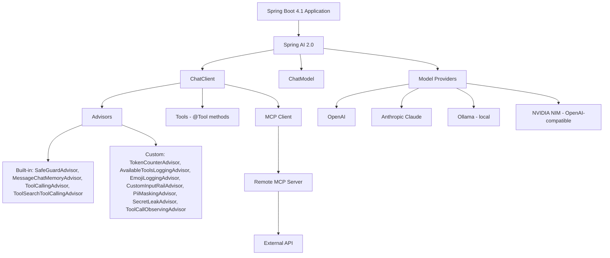

# 🤖 Spring AI Playground

A collection of focused, self-contained **Spring AI** experiments — each one a small, independent Spring Boot 4.1 application that isolates a single modern Spring AI 2.0 capability and demonstrates it end-to-end through a handful of REST endpoints.

There's no shared parent POM and no shared runtime here on purpose: every folder in this repo is its own Maven project with its own `pom.xml` and Maven Wrapper, so you can clone the whole thing, `cd` into whichever concept you're curious about, and run it in isolation.

The playground currently covers:

| Concept | Where |
|---|---|
| 💬 `ChatClient` vs `ChatModel` | [`chatclient-vs-chatmodel`](#51--chatclient-vs-chatmodel) |
| 🔄 Structured output + self-correction | [`self-correcting-structured-output`](#52--self-correcting-structured-output) |
| 🧩 Custom Advisors | [`spring-ai-custom-advisors`](#53--spring-ai-custom-advisors) |
| 🛡️ Guardrails | [`spring-ai-guardrails`](#54--spring-ai-guardrails) |
| 🔎 Tool Search (progressive tool disclosure) | [`spring-ai-tool-search`](#55--spring-ai-tool-search) |
| ⚡ Tool calling + streaming (SSE) | [`tool-calling-streaming`](#56--tool-calling-streaming) |
| 🐦 MCP client (X's hosted MCP servers) | [`x-mcp-client`](#57--x-mcp-client) |

Every project talks to a real LLM provider — OpenAI, Anthropic Claude, a local Ollama model, or NVIDIA NIM (via the OpenAI-compatible client) — and every claim in this README is grounded directly in the source under each project's `src/`.

---

## ✨ What This Playground Covers

The seven projects roughly trace a learning path through Spring AI 2.0, from the two ways of talking to a model, up to the protocol-level integrations built on top of it:

```text
Basic model interaction  →  Structured output  →  Advisors  →  Guardrails  →  Tools  →  Streaming  →  MCP
   (ChatClient/ChatModel)   (validateSchema())    (custom)     (4 layers)   (Tool Search)  (SSE)    (X servers)
```

Each project is a teaching artifact for one idea, kept small enough to read end-to-end in a sitting, but built with production-shaped conventions: layered packages (`config` / `controller` / `service` or `advisor` / `model` or `tool`), Javadoc on the interesting classes, and `.http` files or `requests.http` scripts to exercise every endpoint without needing Postman.

---

## 📚 Table of Contents

- [✨ What This Playground Covers](#-what-this-playground-covers)
- [🧩 Examples Overview](#-examples-overview)
- [🧠 Detailed Explanation of Each Example](#-detailed-explanation-of-each-example)
  - [5.1 💬 ChatClient vs ChatModel](#51--chatclient-vs-chatmodel)
  - [5.2 🔄 Self-Correcting Structured Output](#52--self-correcting-structured-output)
  - [5.3 🧩 Spring AI Custom Advisors](#53--spring-ai-custom-advisors)
  - [5.4 🛡️ Spring AI Guardrails](#54--spring-ai-guardrails)
  - [5.5 🔎 Spring AI Tool Search](#55--spring-ai-tool-search)
  - [5.6 ⚡ Tool Calling + Streaming](#56--tool-calling-streaming)
  - [5.7 🐦 X MCP Client](#57--x-mcp-client)
- [🏗️ Overall Architecture](#️-overall-architecture)
- [🛠️ Technology Stack](#️-technology-stack)
- [⚙️ Prerequisites](#️-prerequisites)
- [🔐 Configuration](#-configuration)
- [🚀 Getting Started](#-getting-started)
- [▶️ Running the Examples](#️-running-the-examples)
- [📂 Project Structure](#-project-structure)
- [🔬 Key Spring AI Concepts](#-key-spring-ai-concepts)
- [🧠 What This Playground Demonstrates](#-what-this-playground-demonstrates)
- [📊 Learning Path](#-learning-path)
- [🚀 Future Experiments](#-future-experiments)
- [🤝 Contributing](#-contributing)
- [📄 License](#-license)
- [👨‍💻 Author](#-author)

---

## 🧩 Examples Overview

| Example | Main Concept | What It Demonstrates |
|---|---|---|
| [`chatclient-vs-chatmodel`](#51--chatclient-vs-chatmodel) | `ChatClient` vs `ChatModel` | The fluent, high-level API vs the raw, low-level interface it's built on |
| [`self-correcting-structured-output`](#52--self-correcting-structured-output) | Structured Output | Turning messy LLM text into a typed Java record, with schema validation and automatic retry on failure |
| [`spring-ai-custom-advisors`](#53--spring-ai-custom-advisors) | Advisors | Three custom advisors (tool-visibility logging, token counting, request/response logging) built on the Advisor API |
| [`spring-ai-guardrails`](#54--spring-ai-guardrails) | Guardrails | Four independent, stackable layers of input/output protection — each with the exact input that defeats it alone |
| [`spring-ai-tool-search`](#55--spring-ai-tool-search) | Tool Search | Progressive tool disclosure — a 47-tool catalog searched on demand instead of loaded into every prompt |
| [`tool-calling-streaming`](#56--tool-calling-streaming) | Tool Calling + Streaming | Streaming an answer token-by-token over SSE while surfacing every intermediate tool call as it happens |
| [`x-mcp-client`](#57--x-mcp-client) | MCP | Connecting Claude to two of X's hosted remote MCP servers (docs + live API) over Streamable HTTP |

---

## 🧠 Detailed Explanation of Each Example

### 5.1 💬 ChatClient vs ChatModel

**Module:** [`chatclient-vs-chatmodel`](chatclient-vs-chatmodel) · Package `com.omar.chatclient_vs_chatmodel` · Provider: OpenAI (`gpt-4o-mini`)

`ChatModel` is Spring AI's low-level interface — you build a `Prompt`, call it, and get back a full `ChatResponse` with every `Generation`, its `AssistantMessage`, finish reason, and token-usage metadata intact. `ChatClient` is the fluent, `RestClient`-style API built **on top of** `ChatModel` — it collapses that same call down to `.prompt().user(...).call().content()` and hides the plumbing, which is why Spring AI recommends it as the entry point for almost every project. You reach for `ChatModel` directly when you need something `ChatClient`'s shortcuts throw away — raw metadata, or multiple generations per call.

```text
Application
     ↓
ChatClient           (fluent builder — .prompt().user().call().content())
     ↓
ChatModel             (raw call(Prompt) → ChatResponse)
     ↓
LLM Provider (OpenAI)
     ↓
Response
```

Both sides are backed by their own `@Service` (`ChatClientService`, `ChatModelService`) and a single `ChatClient` bean configured in `config/ChatClientConfig.java` with a default system prompt.

| Endpoint | What it shows |
|---|---|
| `GET /api/chat-client/ask?message=...` | Plain-text answer via the fluent chain; falls back to a canned Spring AI prompt if `message` is omitted |
| `GET /api/chat-client/ask-as` | The same fluent API, overriding the default system prompt per request |
| `GET /api/chat-model/ask?message=...` | The `ChatModel`-only equivalent of `ask`, going through `ChatResponse` directly |
| `GET /api/chat-model/metadata` | Returns model name, finish reason, and prompt/completion/total token usage — everything `ChatClient.content()` discards |

> The codebase also contains a `MultiGenerationResponse` DTO and a reserved prompt constant for a "multiple generations per call" (`n > 1`) demo — a `ChatModel`-only feature `ChatClient` can't surface — but no endpoint currently calls it, so it's present as scaffolding rather than a working demo yet.

---

### 5.2 🔄 Self-Correcting Structured Output

**Module:** [`self-correcting-structured-output`](self-correcting-structured-output) · Package `com.omar.scso` · Providers: Ollama (default), NVIDIA NIM, Anthropic

A conference-CFP triage API that turns messy, free-form talk-submission text into a typed `TalkSubmission` record — and demonstrates the two independent, opt-in switches Spring AI 2.0 adds to `ChatClient.entity(...)` to make that reliable:

| Switch | Fixes | Direction |
|---|---|---|
| `.validateSchema()` | Validates the model's output against the generated JSON Schema; on failure, the specific error is fed back into the prompt and the call retries (3 attempts by default) | Response-side |
| `.useProviderStructuredOutput()` | Asks the provider's API to enforce the schema up front, before it answers | Request-side |

Both are off by default, so calling `.entity(TalkSubmission.class)` alone behaves exactly as it always has — hoping the model follows the schema embedded in the prompt.

**The domain type**, `model/TalkSubmission.java`, is a plain record with no annotations:

```java
public record TalkSubmission(
        String title,
        String talkAbstract,
        Level level,
        Track track,
        int durationMinutes,
        List<String> tags,
        String speakerHandle) {

    public enum Level { BEGINNER, INTERMEDIATE, ADVANCED }
    public enum Track { WEB, AI, DATA, CLOUD, SECURITY, LANGUAGES }
}
```

Spring AI reads the record's shape alone — property names, types, enum values, required fields — and generates a JSON Schema from it via `JsonSchemaGenerator`.

| Endpoint | What it shows |
|---|---|
| `POST /api/submissions/typed` | `.call().entity(TalkSubmission.class)` — no validation, no retries; the old way |
| `POST /api/submissions/validated` | `.entity(TalkSubmission.class, spec -> spec.validateSchema())` — self-correcting retries |
| `POST /api/submissions/combined` | `.entity(TalkSubmission.class, spec -> spec.useProviderStructuredOutput().validateSchema())` — both switches together |
| `GET /api/submissions/schema` | Returns the raw JSON Schema generated from `TalkSubmission` |

`config/ChatClientConfig.java` builds a single `ChatClient` bean with a system prompt instructing the model to stay faithful to the speaker's original wording. Three Spring profiles select the model provider without touching `pom.xml` — Ollama, OpenAI-compatible NVIDIA NIM, and Anthropic starters are all on the classpath at once, and `spring.ai.model.chat` in each profile decides which one wins the bean.

---

### 5.3 🧩 Spring AI Custom Advisors

**Module:** [`spring-ai-custom-advisors`](spring-ai-custom-advisors) · Package `com.omar.spring_ai_custom_advisors` · Provider: OpenAI (`gpt-4o-mini`)

Advisors are Spring AI's AOP-style interceptors for `ChatClient` calls — they sit in an ordered chain around every request/response and can inspect, log, or modify traffic before it reaches the model and after the response comes back. This project builds three from scratch:

```text
Application
     ↓
ChatClient
     ↓
Advisor Chain
     ↓
Custom Advisor(s)
     ↓
Model
     ↓
Response
```

| Advisor | Type | What it does |
|---|---|---|
| `AvailableToolsLoggingAdvisor` | `BaseAdvisor` | Prints, per LLM call, exactly which tools were visible to the model (`before`) and which ones it actually invoked (`after`) |
| `TokenCounterAdvisor` | `BaseAdvisor` | Tracks prompt/completion/total token usage per call and a running total across calls, ordered near `LOWEST_PRECEDENCE` so it observes every iteration |
| `EmojiLoggingAdvisor` | `CallAdvisor` | A minimal request/response debug logger with pluggable `toString` formatting functions, serializing the response to JSON |

`config/ChatClientConfig.java` builds a bare `ChatClient` bean; each controller endpoint attaches only the advisor(s) it's demonstrating.

| Endpoint | What it shows |
|---|---|
| `GET /api/advisors/tools-logging?question=...` | `AvailableToolsLoggingAdvisor` in isolation |
| `GET /api/advisors/token-counter?question=...` | `TokenCounterAdvisor` in isolation |
| `GET /api/advisors/emoji-logging?question=...` | `EmojiLoggingAdvisor` in isolation |
| `GET /api/advisors/combined?question=...` | All three stacked on one call |

All four accept an optional `question` param and fall back to a Spring Boot dependency-injection question when omitted. The project also defines a `DateTimeTools` class (`@Tool getCurrentDateTime`) that exists in `tool/` but isn't currently registered on the `ChatClient` bean, so it's not yet reachable from any endpoint.

---

### 5.4 🛡️ Spring AI Guardrails

**Module:** [`spring-ai-guardrails`](spring-ai-guardrails) · Package `com.omar.spring_ai_guardrails` · Provider: OpenAI

Four independent layers of protection, built and *broken* one at a time — for every layer, the project shows the exact input that walks straight past it, then the next layer built specifically to catch that gap. This distinguishes **model behavior** (the system prompt, which only ever *scopes* the model's intent) from **application-level controls** (advisors enforced in code, which the model cannot talk its way around).

| # | Layer | Protects Against | Enforced By |
|---|---|---|---|
| 1️⃣ | System Prompt | Off-topic requests | The model's own judgment (soft — no code enforcement) |
| 2️⃣ | `SafeGuardAdvisor` (built into Spring AI) | Known sensitive words | Case-sensitive substring match — real, but narrow |
| 3️⃣ | `CustomInputRailAdvisor` | Case tricks, spacing, injection phrases | A custom `CallAdvisor` that normalizes input (Unicode-fold → lowercase → strip non-alphanumerics) before matching |
| 4a | `SecretLeakAdvisor` | Secrets leaking into the model's *response* | Scans the response, not the input — catches values that were obfuscated on the way in |
| 4b | `PiiMaskingAdvisor` | PII (cards, SSNs, emails, phone numbers) reaching the model or the logs | Masks before the request is sent; its `getOrder()` — not registration order — decides whether `SimpleLoggerAdvisor` sees masked or raw text |

`config/GuardrailProperties.java` holds the sensitive-word/secret/blocked-phrase lists (bound from `application.yaml`); `config/GuardrailsConfig.java` enables those properties. Deliberately, there's **no shared pre-built `ChatClient`** — each controller builds its own client from the injected `ChatClient.Builder` and attaches a different combination of advisors, so every layer can be demonstrated in isolation before being stacked.

| Endpoint group | Examples |
|---|---|
| `GET /api/system-prompt/*` | `on-topic-refusal`, `bypass` |
| `GET /api/safeguard/*` | `blocked`, `bypass-case`, `bypass-synonym` |
| `GET /api/input-rail/*` | `catches-case-bypass`, `catches-spacing-bypass`, `catches-injection`, `allows-clean-input` |
| `GET /api/secret-leak/*` | `caught-on-output`, `without-output-guard` |
| `GET /api/pii/*` | `masked-before-log`, `logger-runs-first` |
| `GET /api/stacked/*` | `clean-request`, `combined-attack` — all four layers run together, ordered `CustomInputRailAdvisor → SafeGuardAdvisor → PiiMaskingAdvisor → SecretLeakAdvisor → SimpleLoggerAdvisor` |

A `.http` file per layer lives under [`spring-ai-guardrails/http/`](spring-ai-guardrails/http).

---

### 5.5 🔎 Spring AI Tool Search

**Module:** [`spring-ai-tool-search`](spring-ai-tool-search) · Package `com.omar.toolsearch` · Provider: Anthropic Claude (`claude-opus-4-8`, default) or NVIDIA NIM (`nvidia` profile)

Every `@Tool` registered on a `ChatClient` gets its full JSON schema serialized into **every** request, before a user types a word — a "tool tax" that grows expensive and error-prone once an agent's catalog reaches dozens of tools. This project makes that cost visible with a live 47-tool catalog (`tool/InitechTools.java` — 6 real tools plus 41 filler tools for a realistic haystack), then shows how Spring AI 2.0's **Tool Search advisor** removes it by giving the model a single, tiny `toolSearchTool` and letting it *search* for whatever capability the current turn needs instead of receiving everything upfront.

```text
User Request
     ↓
LLM (sees only the toolSearchTool)
     ↓
Tool Discovery / Search  (query against the indexed catalog)
     ↓
Relevant Tool(s) expanded into the conversation
     ↓
Tool Execution
     ↓
LLM
     ↓
Final Response
```

Tool indexes are built **per session** (keyed off `ChatMemory.CONVERSATION_ID` by default), so concurrent conversations stay isolated. `config/VectorStoreConfig.java` wires an in-memory `SimpleVectorStore` (via `spring-ai-starter-model-transformers`) so tools can be found by natural-language description rather than exact-name matching — one of three available strategies (`vector`, `lucene`, `regex`).

`AvailableToolsLoggingAdvisor` and `TokenCounterAdvisor` (reused from the same pattern as `spring-ai-custom-advisors`) print live before/after tool visibility and token counts to the console.

| Endpoint | Tools sent to the model |
|---|---|
| `GET /before?message=...` | None — baseline prompt cost |
| `GET /after?message=...` | All 47, every request — the naive approach |
| `GET /tool-search?message=...` | Only what the model searches for, per turn |

The project's own [README](spring-ai-tool-search/README.md) reports the measured token difference for the same question: **17** tokens with no tools, **5,111** with all 47 loaded naively, and **~1,166** via tool search — roughly a **5x reduction** over the naive approach while retaining access to the full catalog.

---

### 5.6 ⚡ Tool Calling + Streaming

**Module:** [`tool-calling-streaming`](tool-calling-streaming) · Package `com.omar.tool_calling_streaming` · Providers: Ollama (default active profile), Anthropic, NVIDIA NIM

A travel-planning chat assistant that streams both its **answer tokens** and its **tool-call lifecycle events** (`STARTED` → `COMPLETED`) to the browser over a single Server-Sent Events connection — the same "Calling tool…" experience Claude and ChatGPT's own UIs show, built from Spring AI 2.0's `ToolCallingAdvisor`.

```text
User
 ↓
LLM
 ↓
Tool Call requested
 ↓
Tool Execution (TravelTools)
 ↓
Tool Result fed back to the model
 ↓
LLM
 ↓
Streaming Response (SSE, merged with tool events)
```

In Spring AI 1.x, the tool-calling loop lived inside each model's `ChatModel` implementation with no clean seam to observe intermediate calls. Spring AI 2.0 lifts that loop into `ToolCallingAdvisor`, a regular, ordered part of the advisor chain — so a plain advisor placed *closer to the model* can observe every iteration. That's exactly what `events/ToolCallObservingAdvisor.java` does here, feeding events into `events/ChatEventStream.java`, which merges them with answer tokens into one SSE `Flux`.

`tool/TravelTools.java` exposes 11 `@Tool` methods (`getCurrentDate`, `getWeatherForecast`, `getCityEvents`, `convertCurrency`, `getPackingSuggestions`, `getLocalTime`, `estimateFlightPrice`, `estimateAccommodationCost`, `getVisaRequirements`, `getPublicTransitOptions`, `getRestaurantRecommendations`) — all currently returning canned/illustrative data, ready to swap for real APIs without touching the `@Tool` contracts.

`config/ChatClientConfig.java` registers only `MessageChatMemoryAdvisor` as a default (at `HIGHEST_PRECEDENCE + 200`, **outside** the tool-calling loop) so conversation memory records just the original user message and final answer per turn, never the intermediate tool iterations.

| Endpoint | Notes |
|---|---|
| `POST /api/chat` | Body: `{"message": "...", "conversationId": "..."}`. Response: `text/event-stream` with `token`, `tool`, `error`, and `done` events |

The project also ships a JTE-rendered browser chat UI (`src/main/jte/index.jte`, plus `static/js/chat.js`) styled with Tailwind — though no controller currently maps a route to render it, so today the demo is exercised directly against `/api/chat` (via `curl -N` or the `.http`/JS client) rather than through a served page.

---

### 5.7 🐦 X MCP Client

**Module:** [`x-mcp-client`](x-mcp-client) · Package `com.omar.x_mcp_client` · Provider: Anthropic Claude (`claude-opus-4-8`)

The **Model Context Protocol (MCP)** standardizes how an AI client discovers and calls tools exposed by a remote server — instead of one bespoke integration per AI tool, a server implements MCP once and any MCP-compatible client gets the same tool surface for free. This project is an **MCP client**: it connects Claude, through Spring AI's MCP client starter, to two of X's (formerly Twitter) real hosted MCP servers over remote **Streamable HTTP**, and lets the model decide — via ordinary tool calling — which one to use for a given question.

| Server | Endpoint | Purpose | Auth |
|---|---|---|---|
| X API Docs | `https://docs.x.com/mcp` | Search/read X's official API documentation | None |
| X API (live) | `https://api.x.com/mcp` | Search posts, look up users, and other live X API operations | Bearer token |

```text
User
 ↓
Spring Boot Application
 ↓
Spring AI ChatClient
 ↓
MCP Client (Streamable HTTP)
 ↓
Remote MCP Server (docs.x.com or api.x.com)
 ↓
X API / X Documentation
```

**MCP flow:** on startup, Spring AI's MCP client auto-configuration opens a Streamable HTTP connection to each server declared under `spring.ai.mcp.client.streamable-http.connections`, calls `tools/list` on each, and aggregates the results into a single `ToolCallbackProvider` — registered as the `ChatClient`'s default tool set in `config/ChatClientConfig.java`. When a controller sends a question, Claude inspects the available tools' names/descriptions/schemas and decides whether the docs tools, the live API tools, or neither are relevant; any resulting tool call is executed by Spring AI's tool-calling manager and the result fed back to Claude for the final answer.

**Authentication:** the `x-docs` connection needs none. The `x-api` connection is authenticated by `config/XApiAuthConfig.java`, an `McpClientCustomizer` bean that attaches a `Bearer` header — read only from the `X_BEARER_TOKEN` environment variable, matched by request host so the token is never sent to `docs.x.com`. The class's own Javadoc flags a real caveat: X documents `api.x.com/mcp` as requiring full OAuth 2.0 + PKCE via X's `xurl` CLI bridge rather than a static bearer header, so a `401` from the live connection reflects that gap rather than a bug in this demo.

| Endpoint | What it shows |
|---|---|
| `GET /docs` | Sends a fixed question about the X API; Claude calls the `x-docs` MCP tools to ground the answer in official documentation |
| `GET /search?topic=...` | Sends a topic (defaults to `"Spring Boot 4.1"`); Claude calls the `x-api` MCP search tool and summarizes recent posts |

---

## 🏗️ Overall Architecture

Each directory in this repository is an **independent, self-contained Spring Boot application** — its own `pom.xml`, its own Maven Wrapper, its own `com.omar.*` package — rather than modules of one monolith. There is no shared parent POM, no shared runtime, and no cross-project Java dependency; the shared elements are conventions (layered packages, `ChatClient`-centric config, `.http` test files) rather than code.



---

## 🛠️ Technology Stack

### Backend
- **Java 21**
- **Spring Boot 4.1.0 / 4.1.1** (version pinned per-project in each `pom.xml`)
- **Spring AI 2.0.0 / 2.0.1 / 2.0.1-SNAPSHOT** (`spring-ai-tool-search` tracks a snapshot and pulls from the Spring Milestone/Snapshot repositories declared in its `pom.xml`)
- Maven, via the Maven Wrapper (`mvnw` / `mvnw.cmd`) — no system-wide Maven install required

### AI / LLM Providers (used across the repo)
- **OpenAI** (`gpt-4o-mini`) — `chatclient-vs-chatmodel`, `spring-ai-custom-advisors`, `spring-ai-guardrails`
- **Anthropic Claude** (`claude-opus-4-8`) — `spring-ai-tool-search` (default), `x-mcp-client`, plus an `anthropic` profile in `self-correcting-structured-output` and `tool-calling-streaming`
- **Ollama** (local `llama3.2:1b`) — default profile in `self-correcting-structured-output` and `tool-calling-streaming`, used specifically to demo small-model failure modes
- **NVIDIA NIM** (`meta/llama-3.1-70b-instruct`, via the OpenAI-compatible client) — `nvidia` profile in `self-correcting-structured-output`, `spring-ai-tool-search`, and `tool-calling-streaming`

### AI Capabilities Exercised
- `ChatClient` (fluent) and `ChatModel` (low-level)
- Structured output: `.entity(...)`, `.validateSchema()`, `.useProviderStructuredOutput()`
- Custom Advisors (`BaseAdvisor`, `CallAdvisor`) and built-in ones (`SafeGuardAdvisor`, `MessageChatMemoryAdvisor`)
- Tool calling (`@Tool`) and the Tool Search advisor (`spring-ai-starter-tool-search-advisor`, `VectorToolIndex`)
- MCP client (`spring-ai-starter-mcp-client`) over Streamable HTTP

### Infrastructure & Notable Libraries
- **Lombok** — `spring-ai-custom-advisors` only (`@Slf4j`, `@RequiredArgsConstructor`)
- **JTE** (`gg.jte`) + Tailwind (via CDN) — a browser chat UI template in `tool-calling-streaming`
- **`SimpleVectorStore`** (in-memory) + `spring-ai-starter-model-transformers` (local embedding model) — semantic tool indexing in `spring-ai-tool-search`
- No Docker/Compose files are present anywhere in the repository, and no external database is used — every project runs standalone with just a Java runtime and the relevant API key(s)/local Ollama install

---

## ⚙️ Prerequisites

- **Java 21+**
- **No system Maven required** — each project ships its own `./mvnw` wrapper
- At least one of the following, depending on which example you run:
  - An **OpenAI API key** — required for `chatclient-vs-chatmodel`, `spring-ai-custom-advisors`, `spring-ai-guardrails`
  - An **Anthropic API key** — required for `spring-ai-tool-search` (default), `x-mcp-client`, and the `anthropic` profile of `self-correcting-structured-output` / `tool-calling-streaming`
  - **[Ollama](https://ollama.com)** running locally with `llama3.2:1b` pulled — the default profile for `self-correcting-structured-output` and `tool-calling-streaming`
  - An **NVIDIA API key** (NVIDIA NIM) — for the `nvidia` profile of `self-correcting-structured-output`, `spring-ai-tool-search`, `tool-calling-streaming`
  - An **X bearer token** (`X_BEARER_TOKEN`) — only needed for `x-mcp-client`'s `/search` endpoint; `/docs` needs no credentials

---

## 🔐 Configuration

Every project reads its API key(s) from environment variables — never from a committed file. A representative example (`spring-ai-tool-search`'s default profile):

```yaml
spring:
  ai:
    model:
      chat: anthropic
    anthropic:
      api-key: ${ANTHROPIC_API_KEY}
      chat:
        model: claude-opus-4-8
```

Never commit a real key. Set it as an environment variable instead:

```bash
export ANTHROPIC_API_KEY=YOUR_API_KEY
export OPENAI_API_KEY=YOUR_API_KEY
export NVIDIA_API_KEY=YOUR_API_KEY
export X_BEARER_TOKEN=YOUR_TOKEN
```

Several projects (`self-correcting-structured-output`, `spring-ai-tool-search`, `tool-calling-streaming`) ship multiple Spring profiles (`application-ollama.yml`, `application-nvidia.yaml`/`.yml`, `application-anthropic.yml`) so the active model provider is a one-line switch:

```bash
./mvnw spring-boot:run -Dspring-boot.run.profiles=nvidia
```

> Spring AI 2.0 no longer auto-activates a chat provider just because its starter is on the classpath. Wherever a project has more than one model starter present, `spring.ai.model.chat` explicitly names the active one.

---

## 🚀 Getting Started

```bash
git clone https://github.com/drissiOmar98/Spring-Ai-Playground.git
cd Spring-Ai-Playground
```

Each subfolder is a **standalone Spring Boot application** — there is no top-level build. Pick a project, `cd` in, export the credentials it needs, and run its own Maven Wrapper:

```bash
cd chatclient-vs-chatmodel
export OPENAI_API_KEY=YOUR_API_KEY
./mvnw spring-boot:run
```

---

## ▶️ Running the Examples

### `chatclient-vs-chatmodel`
```bash
cd chatclient-vs-chatmodel
export OPENAI_API_KEY=YOUR_API_KEY
./mvnw spring-boot:run
curl "http://localhost:8080/api/chat-client/ask?message=What+is+Spring+AI%3F"
```

### `self-correcting-structured-output`
```bash
cd self-correcting-structured-output
ollama pull llama3.2:1b        # default profile
./mvnw spring-boot:run
# then fire requests.http, or:
curl -X POST http://localhost:8080/api/submissions/validated \
  -H "Content-Type: text/plain" --data-binary @samples/messy-submission.txt
```

### `spring-ai-custom-advisors`
```bash
cd spring-ai-custom-advisors
export OPENAI_API_KEY=YOUR_API_KEY
./mvnw spring-boot:run
curl "http://localhost:8080/api/advisors/combined"
```

### `spring-ai-guardrails`
```bash
cd spring-ai-guardrails
export OPENAI_API_KEY=YOUR_API_KEY
./mvnw spring-boot:run
# run any file under http/ (IntelliJ HTTP Client / VS Code REST Client)
```

### `spring-ai-tool-search`
```bash
cd spring-ai-tool-search
export ANTHROPIC_API_KEY=YOUR_API_KEY
./mvnw spring-boot:run
curl "http://localhost:8080/before?message=What+is+tomorrow%27s+date%3F"
curl "http://localhost:8080/after?message=What+is+tomorrow%27s+date%3F"
curl "http://localhost:8080/tool-search?message=What+is+tomorrow%27s+date%3F"
```

### `tool-calling-streaming`
```bash
cd tool-calling-streaming
ollama pull llama3.2:1b        # default active profile
./mvnw spring-boot:run
curl -N -X POST http://localhost:8080/api/chat \
  -H "Content-Type: application/json" \
  -d '{"message": "Plan a 3-day trip to Chicago next week", "conversationId": "demo-1"}'
```

### `x-mcp-client`
```bash
cd x-mcp-client
export ANTHROPIC_API_KEY=YOUR_API_KEY
export X_BEARER_TOKEN=YOUR_TOKEN   # only needed for /search
./mvnw spring-boot:run
curl localhost:8080/docs
curl "localhost:8080/search?topic=Spring%20AI"
```

---

## 📂 Project Structure

```text
Spring-Ai-Playground/
│
├── chatclient-vs-chatmodel/            # ChatClient vs ChatModel (OpenAI)
├── self-correcting-structured-output/  # Structured output + validateSchema() (Ollama/NVIDIA/Anthropic)
├── spring-ai-custom-advisors/          # 3 custom Advisors (OpenAI)
├── spring-ai-guardrails/               # 4-layer input/output guardrails (OpenAI)
├── spring-ai-tool-search/              # Tool Search advisor + 47-tool catalog (Anthropic/NVIDIA)
├── tool-calling-streaming/             # SSE tool-call streaming, travel chat (Ollama/Anthropic/NVIDIA)
├── x-mcp-client/                       # MCP client for X's docs + live API servers (Anthropic)
└── README.md                           # this file
```

Each folder above additionally follows the same internal shape: `src/main/java/com/omar/<project>/` split into `config/`, `controller`/`web`, and one or more of `service`, `advisor`, `model`, `tool`; `src/main/resources/` for `application*.yaml`; and, where present, `.http` files or a `requests.http`/`http/` folder for exercising every endpoint.

---

## 🔬 Key Spring AI Concepts

**`ChatClient`** — the fluent, high-level entry point (`.prompt().user().call().content()`), recommended for most application code. Appears in every project; contrasted directly against `ChatModel` in [5.1](#51--chatclient-vs-chatmodel).

**`ChatModel`** — the low-level interface `ChatClient` is built on; returns the full `ChatResponse` with metadata `ChatClient`'s shortcuts hide. Demonstrated directly in [5.1](#51--chatclient-vs-chatmodel).

**Structured Output** — mapping free-form model text to a typed Java object via a generated JSON Schema, with an optional response-side validation retry (`validateSchema()`) and/or a request-side provider constraint (`useProviderStructuredOutput()`). Central to [5.2](#52--self-correcting-structured-output).

**Advisors** — ordered interceptors (`BaseAdvisor` / `CallAdvisor` / `StreamAdvisor`) around every `ChatClient` call, controlled by `getOrder()` rather than registration order. Built from scratch in [5.3](#53--spring-ai-custom-advisors), stacked defensively in [5.4](#54--spring-ai-guardrails), and used to observe the tool-calling loop in [5.6](#56--tool-calling-streaming).

**Guardrails** — application-level controls (advisors, input normalization, output scanning) that don't rely on the model choosing to comply, as opposed to a system prompt, which only ever scopes intent. See [5.4](#54--spring-ai-guardrails).

**Tool Calling** — exposing Java methods to the model via `@Tool`, letting it request their execution mid-conversation. Used in [5.3](#53--spring-ai-custom-advisors) (a `DateTimeTools` class, not yet wired), [5.5](#55--spring-ai-tool-search) (a 47-tool catalog), and [5.6](#56--tool-calling-streaming) (11 travel tools).

**Streaming** — token-by-token response delivery via `Flux`, merged in [5.6](#56--tool-calling-streaming) with intermediate tool-call lifecycle events over Server-Sent Events.

**Tool Search** — progressive tool disclosure: the model gets a single `toolSearchTool` and searches a `ToolIndex` (vector, Lucene, or regex-backed) for relevant tools on demand, instead of every tool's schema being sent on every call. See [5.5](#55--spring-ai-tool-search).

**MCP (Model Context Protocol)** — a standard protocol for exposing tools from a remote server to any compatible AI client. This repo's `x-mcp-client` acts as the **client** side, connecting to two of X's real hosted MCP servers. See [5.7](#57--x-mcp-client).

---

## 🧠 What This Playground Demonstrates

- LLM integration through Spring AI's dual `ChatClient`/`ChatModel` APIs
- Multi-provider configuration (OpenAI, Anthropic, Ollama, NVIDIA NIM) via Spring profiles, without touching `pom.xml`
- Reliable structured data generation, including response-side validation and request-side provider constraints
- Building custom Advisors from the ground up, and understanding that execution order comes from `getOrder()`, not registration order
- Defense-in-depth guardrail design — attacking and then closing each layer's specific gap
- Tool calling, from a handful of `@Tool` methods up to a 47-tool catalog with searchable, on-demand disclosure
- Real-time streaming of both model tokens and intermediate tool-call lifecycle events over SSE
- Acting as an MCP **client** against real, hosted, authenticated and unauthenticated remote MCP servers

---

## 📊 Learning Path

```text
1️⃣ ChatClient vs ChatModel
        ↓
2️⃣ Self-Correcting Structured Output
        ↓
3️⃣ Custom Advisors
        ↓
4️⃣ Guardrails
        ↓
5️⃣ Tool Search
        ↓
6️⃣ Tool Calling + Streaming
        ↓
7️⃣ MCP Client
```

This order builds concept on concept: `ChatClient`/`ChatModel` (1) is the foundation every later example uses; structured output (2) is the simplest thing to layer on top of a single call; Advisors (3) are the mechanism guardrails (4) and tool observation (6) are both built from; Tool Search (5) and streaming tool calls (6) both assume you already understand basic tool calling; and MCP (7) is a protocol-level integration best understood once tool calling itself is familiar.

---

## 🚀 Future Experiments

*(Ideas — none of the following exist in the repository today.)*

- Retrieval-Augmented Generation (RAG) with a persistent vector store (e.g. pgvector, replacing `SimpleVectorStore`)
- Evaluation harnesses for structured-output accuracy and guardrail bypass rates
- Observability (Micrometer/OpenTelemetry tracing across the advisor chain)
- Centralized prompt management/versioning
- Multi-step agent workflows spanning several of these examples at once
- An MCP **server** (the other side of what `x-mcp-client` demonstrates)
- Multi-tool agents combining Tool Search with MCP-sourced tools
- Persistent `ChatMemory` (JDBC-backed) for `tool-calling-streaming`, beyond in-process
- Production-hardening: rate limiting, auth, and secrets management around the guardrails demo

---

## 🤝 Contributing

This is primarily a personal learning/demo repository, but issues and pull requests are welcome — especially fixes, clearer explanations, or a new self-contained example following the same per-project conventions (own `pom.xml`, layered packages, `.http` file(s) for every endpoint).

1. Fork the repository
2. Create a feature branch (`git checkout -b feature/my-example`)
3. Keep new examples self-contained, in their own top-level folder
4. Open a pull request describing what the example demonstrates

---

## 📄 License

This repository does not currently specify a license.

---

## 👨‍💻 Author

**Omar Drissi**

- GitHub: [@drissiOmar98](https://github.com/drissiOmar98)
- LinkedIn: [omar-drissi](https://www.linkedin.com/in/omar-drissi-4798171a4/)
